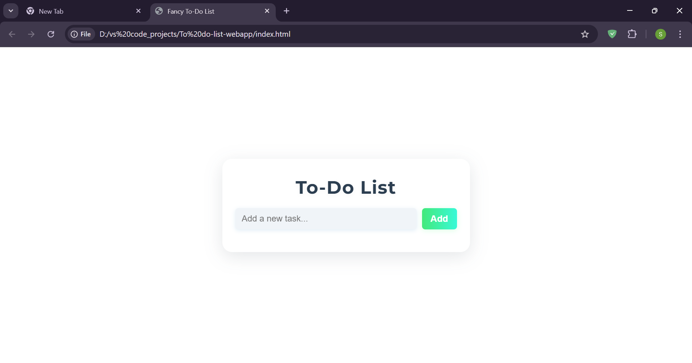
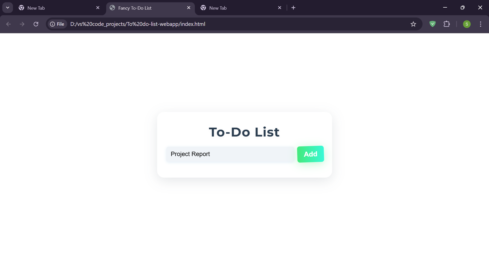
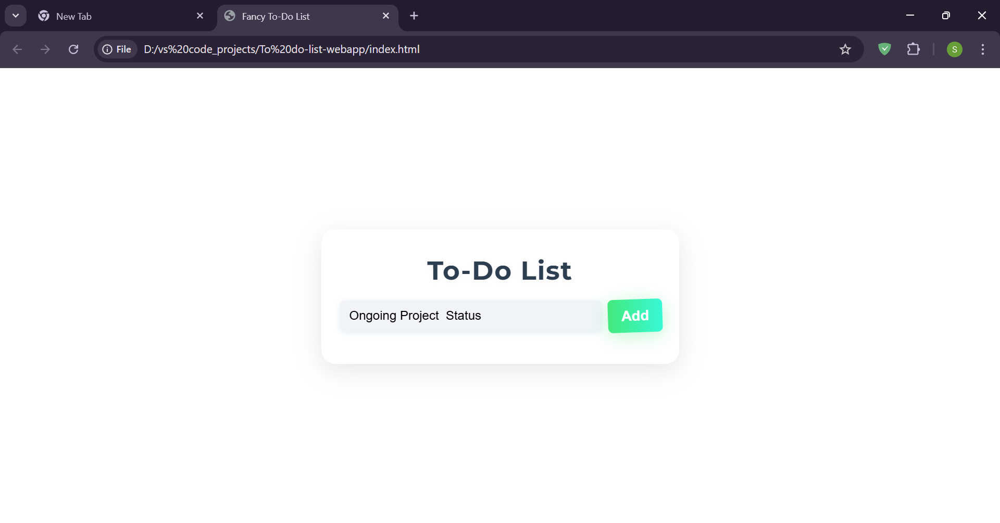

# To-Do List App

A simple, responsive To-Do List web application built with HTML, CSS, and JavaScript. Tasks are stored in `localStorage` so your list is saved even after closing the browser.

## Features

- Add and delete tasks
- Mark tasks as completed (click on text)
- Persistent storage using browser localStorage
- Responsive design (works on mobile and desktop)

## Demo

## How to Run

1. Download or clone the repo
2. Open `index.html` in your browser

## Screenshots

### Home Page  
Input field to enter new tasks.  

### Task Added  
A task is added and appears below.  

### Multiple Tasks  
More tasks are added to the list.  
! [Screenshot 3](Screenshot_3.png)

### Mark as Completed / Important  
Tasks can be marked with status.  
! [Screenshot 4](Screenshot_4.png)

### Delete a Task  
A task is removed from the list.  
! [Screenshot 5](Screenshot_5.png)

### Responsive Support  
While this screenshot is taken on desktop, the app is fully responsive and works smoothly on mobile devices too.  
! [Screenshot 6](Screenshot_6.png)

## License

MIT

